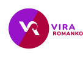

# PORTFOLIO WEBSITE



This is my Portfolio Website. You can find live version at https://www.viraromanko.com


## SET UP
* Clone the Repo ```git clone```
* Install NODE ``` npm install```
* Open MAMP/WAMP
* Import the database from Database folder
* Inside the project folder in terminal run ```node app```
* Your project is running on localhost:30001


## Build with/ Tools
* **HTML5**
* **SASS/CSS3**
* **JavaScript**
* **Mysql**
* **NODE JS**
* **EXPRESS**
* **THREE.JS**- for hero background animantion
* **GSAP**-  for scrolling animations
* **Gulp**
* **Bootstrap**

## Workspace (development)
* Visual Studio Code
* Terminal
* GitHub


## Workspace (design)
* Adobe XD
* Adobe Photoshop/Illustrotor
* Figma


## Authors
* **Vira Romanko** -*Developer/Designer*


## Acknowledgment/References

* **Pinterest/Dribbble/Google** - *Design inspiration/images* 


## Future Plans
* Add more interactivity
* JS and SASS file structure
* add "learning is my superpower" in a new section with all the certificates I have


